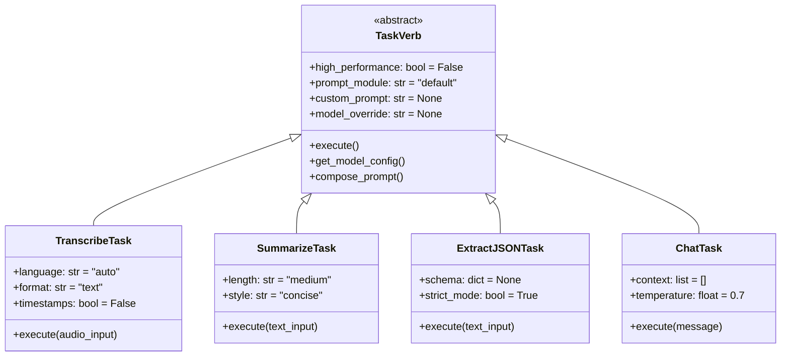
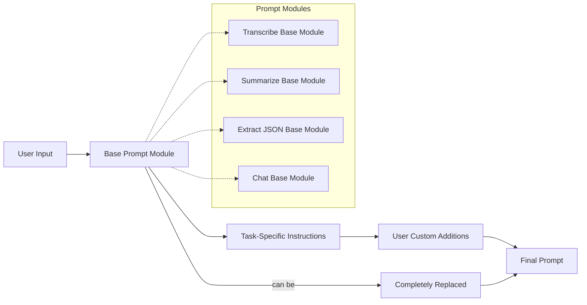
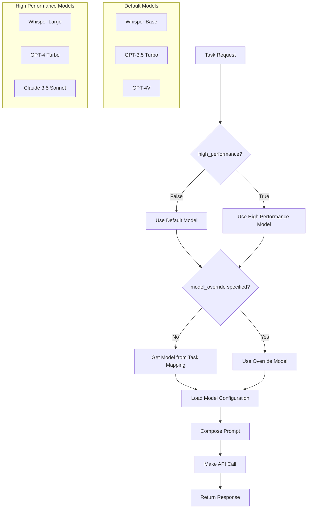

# SURUS Architecture

## System Structure

```mermaid
graph TB
    User[User Application] --> SURUS[SURUS Client]
    
    SURUS --> TaskRouter[Task Router]
    TaskRouter --> Transcribe[transcribe()]
    TaskRouter --> Summarize[summarize()]
    TaskRouter --> ExtractJSON[extract_to_json()]
    TaskRouter --> Chat[chat()]
    TaskRouter --> Annotate[annotate()]
    
    Transcribe --> AudioEngine[Audio Engine]
    Summarize --> TextEngine[Text Engine]
    ExtractJSON --> TextEngine
    Chat --> TextEngine
    Annotate --> VisionEngine[Vision Engine]
    
    AudioEngine --> AudioModels[Audio Models]
    TextEngine --> TextModels[Text Models]
    VisionEngine --> VisionModels[Vision Models]
    
    AudioModels --> OpenAI_Audio[OpenAI Whisper]
    AudioModels --> AssemblyAI[AssemblyAI]
    
    TextModels --> OpenAI_Text[OpenAI GPT]
    TextModels --> Anthropic[Anthropic Claude]
    TextModels --> TogetherAI[Together AI]
    
    VisionModels --> OpenAI_Vision[OpenAI GPT-4V]
    VisionModels --> Anthropic_Vision[Anthropic Claude Vision]
```

## Task Interface



## Prompt Composition



## Model Selection

